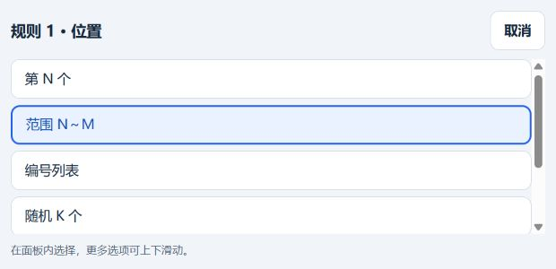

# Phigros 离线共存测试项目

基于 Phigros 4.0.1（157）的非官方 arm64 本地测试修改版。当前候选为 **166 预发布版：手机交互修复仍待真机验收**。

## 下载与安装

[进入 Releases](https://github.com/yskzctx/phigros-offline-lab/releases)。下载同一版本的全部 `Phigros-offline-166.7z.00*` 分卷及 `SHA256SUMS.txt`，放在同一文件夹，用 7-Zip 打开 `.7z.001` 解压得到 APK。分卷不是 APK。校验文件同时记录分卷和解压后的 APK 的 SHA-256。Git 历史不存放大型 APK。

修改版包名 `com.PigeonGames.Phigros.offline`，正版 `com.PigeonGames.Phigros`。不同签名、独立应用数据目录。166 沿用本项目的修改版签名，可覆盖升级 164/165，无须卸载；卸载会删除修改版内部数据。先备份自己的正版 APK 和存档，勿把修改版数据覆盖到正版。运行不需要 root、LSPosed 或 Frida。

## 166 修复

准确率模式只要求准确率，分数模式只要求分数，默认 AP 不要求目标输入；解决非当前模式隐藏字段阻止保存的问题。

判定和位置改为浮窗内的选项列表，点击后可上下滑动并选择或取消，解决原生下拉框被置顶浮窗遮住的问题。

166 仅更改 Java 配置校验、内置界面及版本号，native、资源与初始存档保持与 165 一致。模式输入回归和浏览器六种位置操作通过；手机验证与安装待完成。详见 [166 修改与验证](CHANGELOG-166.md)。165 已知上述两项问题，其余游戏内功能验收仍按下表记录。

## 165 引入的功能

- 浮窗重做为浅灰底、白色卡片、深色文字、蓝色主按钮；分为「游玩」「判定规则」「存档」，保存按钮固定在底部。可拖动标题栏，点击「收起」关闭。
- 移除每次启动的自动游玩询问。游戏进入前台时打开面板；每次进程冷启动自动游玩默认关闭，目标模式与规则仍保留。首次使用需授予悬浮窗权限。
- 音量上键打开面板，下键关闭；面板打开时拦截音量键。关闭后下键正常调音量，上键仍为面板入口。
- 自动游玩提供默认 AP、目标分数、目标准确率三种模式。用实际 Miss / Good 判定计划接近目标，**不再覆盖结算分数**；准确率支持两位小数。音符数量、判定分布、实际判定先后和最长连击会影响误差，不承诺精确到个位分。
- 判定改成最多 16 条规则的列表，支持 Miss / Good / Bad，以及编号、范围、列表、随机数量、连续数量、全部音符。范围包含两端，随机不重复，越界编号忽略。编号按游戏的整谱时间列表，从 1 开始；重叠音符由靠前的规则优先处理。规则高于目标规划，保存后下局使用新计划。
- 为计划 Miss 保留未触碰音符的正常超时路径，不再给它写入自动输入标记。面板显示计划数量、已执行数量和预测结果，日志记录真实结算。**此路径仍需游戏内实测**。
- 历史 RKS 支持四位小数，下次进程冷启动修改历史；16.00 示例有 139 份 AP，其余为模拟非 AP。它不是实际游玩成绩，也不是持续固定 RKS，普通后续游玩会改变它。
- 最大值输入 17.3166～17.32，或点击「恢复全部 AP」，恢复目录中的全部 1037 份常规历史为 1000000 分、100% 和 AP，修复先前只恢复决定 RKS 的部分历史的问题。实际最大 RKS 约 17.3167；17.32 是上限的两位小数表示。
- 「重置游玩设置」只重置目标和规则；「恢复全部 AP」与「恢复上次备份」处理历史，均在冷启动执行。恢复备份只替换历史，不把收藏、剧情和当前余额一起回退。
- 首次使用 165 在修改版自己的本地存档中补到至少 **10000 MB Data**，只补一次，已有更高余额保留。游戏按 1024 自动换算，可能显示约 9.77 GB。这是本地游戏 Data，不修改在线账户、购买或付费资源。
- 保留已有本地解锁与收藏成果。少数货币解锁歌曲仍走游戏原有流程，不宣称已遍历每个内容页。

## 存档与恢复

修改历史或初始化 Data 前，备份两个游戏 XML 到修改版内部的 `files/offline-rks/backups/<时间>/`。菜单「恢复上次备份」恢复其中的历史记录，保留当前其他字段。需要完整回滚时，可在退出并强停修改版后，用自己的调试备份流程把对应 XML 恢复到**修改版自己的** `shared_prefs/`，不能恢复到正版目录。

开启自动游玩前另备份到修改版内部 `files/offline-session/`。本次自动会话的游戏存档在下一次进程冷启动恢复；面板配置独立保留。启用后同进程关闭开关不会卸载原生库；完全关闭进程后，手动启动路径不加载修改库。这里的冷启动指完全结束进程后启动，普通切到后台再回来不等于冷启动。

## 验证状态

| 范围 | 结论 |
| --- | --- |
| 163 开启/关闭启动、章节资源修复 | 曾在真机观察通过 |
| 163 自动游玩、第九章异象、收藏页 | 用户反馈正常；全内容页未穷尽 |
| 164 RKS 16、自动游玩 | 用户反馈可用，同时报告恢复 AP、目标结算与浮窗问题 |
| 165 签名、对齐、资源 CRC | 通过；原游戏 native 与 Unity 资源保持一致 |
| 165 目标分数/准确率、规则优先级、范围/随机数量 | 独立 C 测试通过 |
| 165 实际 native 分派代码、自然 Miss 输入隔离、结算不覆盖 | 主机模拟测试通过，未测试 ARM64 安装后的游戏调用 |
| 165 RKS 16 → 最大值、独立 AP 恢复、备份保留余额 | JVM 存档测试通过 |
| 165 AES/XML、实际 float RKS、无关字段字节保留 | 独立 Python 交叉验证通过 |
| 165 浅色页面、规则编辑、窄窗口布局 | 浏览器预览通过；Android WebView、键盘和悬浮窗待测 |
| 165 真机启动、Miss/Good 画面与结算、成绩恢复、原版共存 | **待验收；构建通过不能替代它们** |

此前设备为 OnePlus Ace 5 竞速版 / Android 16 / arm64 / 4096 字节内存页。没有 ColorOS 15 全面兼容结论。

## 启动修复与源码

原提取索引漏掉主包 `sharedassets0.resource`，导致音效加载空指针；后续还发现 `unity default resources` 缺失，导致章节皮肤加载失败。已补齐主包全部 11 个 Unity 数据文件。单纯把资源移到 APK 2GB 偏移以内不是确认的根因。

`src/` 是 Java 会话、浮窗、历史处理和 native 控制；`ui/` 是实际内置的浅色界面；`data/` 为内容版本的谱面目录；`tests/` 为独立回归测试。此仓库是可审查的修改源，**不是从零构建整个游戏的工程**，仍需合法原版资源与自己的签名设置。没有签名私钥、密码、私人存档、手机日志、设备标识或登录凭据。版本相关地址不能套用到其他版本。

不含 INTERNET 权限，不上传数据，不用于在线排行榜、真实成绩证明或反作弊绕过。不实现购买、账号、服务器、签名完整性或加固校验绕过。

阅读 [免责声明](DISCLAIMER.md)。游戏资源不会因此成为开源素材；本仓库不授予它们新许可证。维护者已声明拥有修改 APK 的公开分发授权；这不是官方背书。
